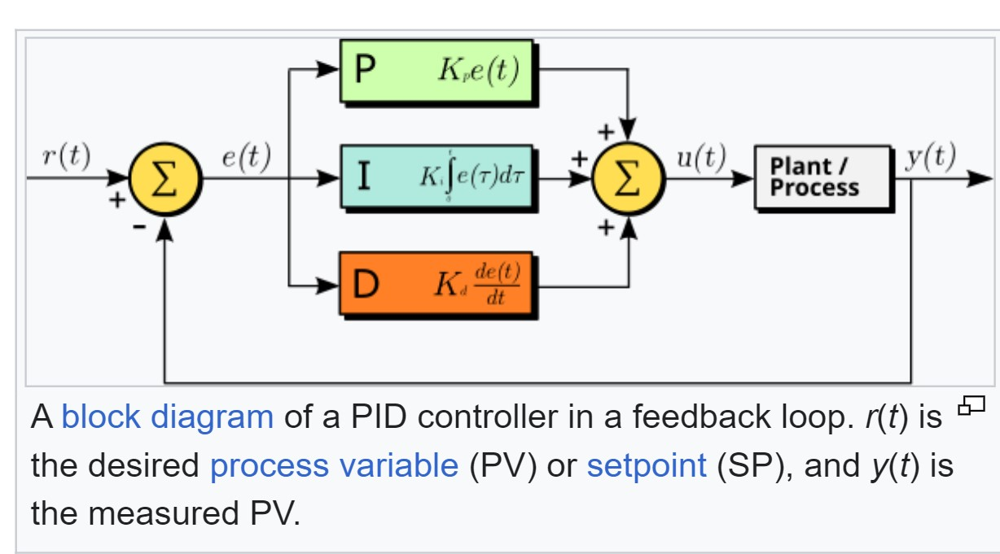
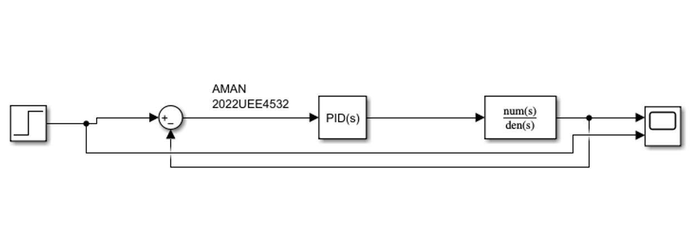
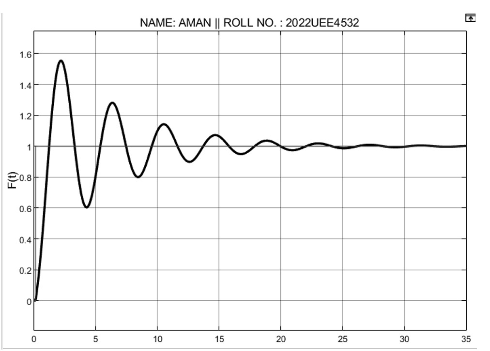

# PID-Controller-Simulation
## Overview

This project demonstrates the implementation and simulation of a PID (Proportional-Integral-Derivative) controller using MATLAB. PID controllers are widely used in industrial control systems to maintain a desired output by adjusting the control input based on the error between the desired and actual values.

## How PID Controllers Work

A PID controller calculates the control input based on three terms:

1. **Proportional (P)**: This term is directly proportional to the error value. It adjusts the control input based on the magnitude of the error. A larger proportional gain results in a stronger response to the error.

2. **Integral (I)**: This term is based on the accumulation of past errors. It sums up the error over time to eliminate residual steady-state errors that the proportional term alone cannot address.

3. **Derivative (D)**: This term predicts future error based on its rate of change. It provides a damping effect, which helps to stabilize the system and reduce overshoot by reacting to the rate of error change.

The PID controller combines these three terms to produce the control input:

\[ u(t) = K_p \cdot e(t) + K_i \cdot \int e(t) \, dt + K_d \cdot \frac{de(t)}{dt} \]

where:
- \( u(t) \) is the control input
- \( e(t) \) is the error at time \( t \)
- \( K_p \), \( K_i \), and \( K_d \) are the proportional, integral, and derivative gains, respectively.
  
## Working
**Block Diagram**: 

## Simulation in MATLAB

This project includes a MATLAB script that simulates the behavior of a PID controller. The simulation consists of:

- **System Model**: Defines the plant or process to be controlled.
- **PID Controller**: Implements the PID control algorithm with adjustable gains.
- **Simulation Setup**: Configures the simulation parameters and runs the simulation.
- **Results Visualization**: Plots the system's response and the control input.

## Screenshots

1. **Simulation Diagram**: 
2. **Resultant Graph**: 
